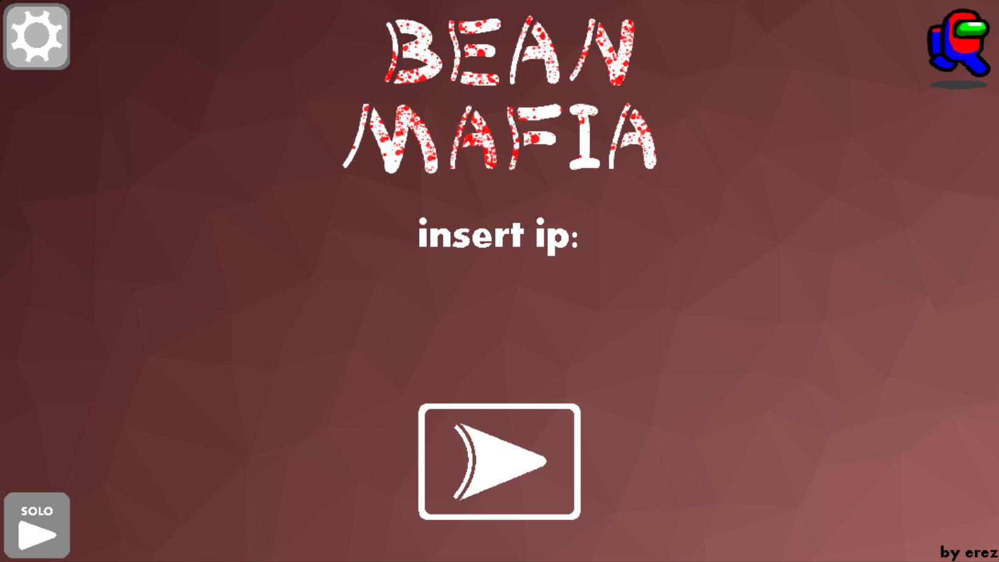
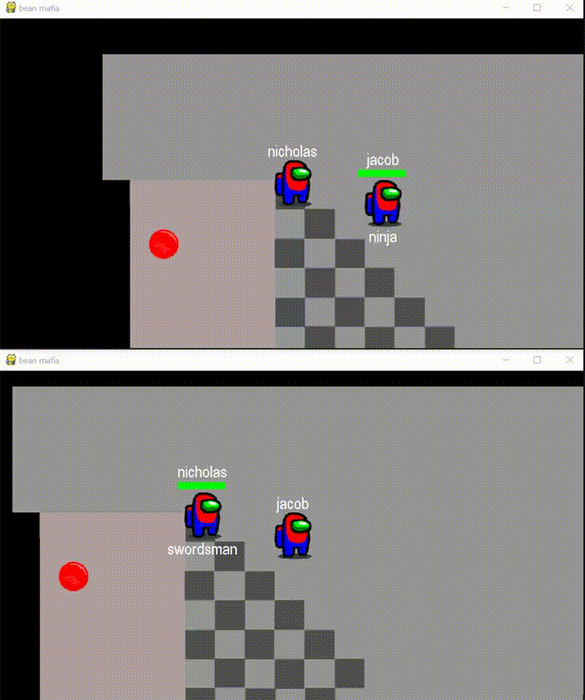

# bean mafia

This is an online game I to experiment with basic servers and design.
Like usual, the code I made isn't particularly pretty, but unlike othe projects I will try to change that somewhat.
This game will be similar in gameplay to generic .io games - you choose a class and fight people.

In this game, the visual elements were constructed so they would only need to be handled once by the programer when they are created. There are image and text elements, but also click and process elements to handle eventing. The biggest problem in a project like this is the scalability, as pygame is very slow.
